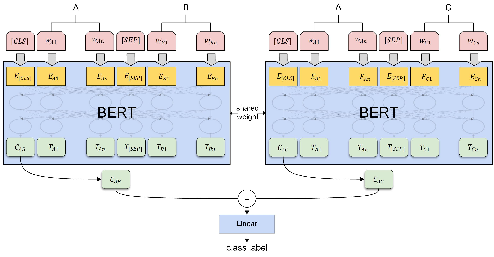

# 法研杯(CAIL 2019)相似案例匹配任务

## 比赛介绍
关于比赛和赛题详情参见[比赛官网](http://cail.cipsc.org.cn/)和[官方 Github 链接](https://github.com/china-ai-law-challenge/CAIL2019)。

简要来说，是一个法律文书相似度计算问题，所有文书来自裁判文书网的真实借贷纠纷案件。

- 问题形式：给定三个文书（A, B, C），预测A与B, C中的哪一个更为相似
- 评价指标：准确率

## 项目方案介绍
我们最终提交的方案主要使用了数据增广和设计了一个孪生 BERT 模型，没有进行模型集成，最终取得了第二名的成绩。

### 数据增广
数据增广是为了解决比赛训练集中三元组样本过少的问题。我们将比赛的训练记作 `(A,B,C),0` 的形式，用 0 表示文书 A 与 B 更相似，1 表示文书 A 与 C 更相似。那么我们可以根据相似案例三元组的一些性质做增广，我们设计了如下几种增广：

|序号   | 描述  | 增广产物  | 
|---|-----------------|-----------|
| 1 | 反对称增广       | (A,C,B), 1 |
| 2 | 自反性增广       | (C,C,A), 0 |
| 3 | 自反性+反对称    | (C,A,C), 1 |
| 4 | 启发式增广       | (B,A,C), 0 |
| 5 | 启发式增广+反对称 | (B,C,A), 1 |

我们在第一阶段测试过这些增广的性能提升：

|方法   | 准确率（5-折交叉平均）  |
|----------------------- |------|
| 反对称增广              | 0.788|
| 反对称+启发式增广       | 0.784|
| 反对称+自反性增广       | 0.810| 
| 反对称+启发式+自反性增广 | 0.852| 

可见增广会提升模型性能，此外还可以降低模型性能方差，提升鲁棒性。

### 2.2 模型结构
模型设计如下：



首先，模型是一个孪生网络的结构，使用了两个共享权重的 BERT 模型，分别将 AB 和 AC 输入 BERT，将对应的 `[CLS]` 取出，并做一个相减运算，最后拼接一个线性层输出后进行分类，使用交叉熵计算二分类损失。

模型可以这么理解，我们认为通过模型监督任务的设计， BERT 输出的 `[CLS]` 可以学习出每次输入的两个句子在各种不同维度上的相似度情况，因此 Cab、Cac分别表示了 AB 的相似度，AC 的相似度，最终将两者相减，就可以对比出在各种不同维度上 AB 相似度更高还是 AC 相似度更高，最终线性层则是对这些维度进行加权，得出一个综合的相似度判定。

我们设计的模型非常简洁明了，对比其他选手的集成模型，我们仅用这样一个单模型就取得了相当好的效果。

### 尝试的其他方法
[tbd]

## 项目构建

### 运行环境

#### 软件依赖

- Python 3.6+
- PyTorch 1.1.0+
- [requirements.txt](requirements.txt)
- Windows 和 Linux 均可
- Nvidia Apex：可选，用于混合精度训练，安装参见[https://github.com/NVIDIA/apex#quick-start](https://github.com/NVIDIA/apex#quick-start)，将代码中 `fp16 = True` 修改为 `fp16 = False` 可不依赖 Apex。使用 apex 可以降低显存消耗并提速。

#### 硬件要求

建议使用多块显卡且显存总量大于 15GB，否则需要降低 batch size。cpu 训练很慢。

我们测试了使用了多种参数和硬件资源资源组合，训练一个 epoch 所需的显存和时间如下（除 CPU 外都启用了混合精度训练）：

|设备   | batch_size  | 显存消耗  | 训练时间  |
|---|---|---|---|
| 4*TITAN X (Pascal) 12g | 12 | 4114MiB/gpu | 23min |
| 2*TITAN X (Pascal) 12g | 12 | 7291MiB/gpu | 35min |
| TITAN X (Pascal) 12g | 10 | 11823MiB  | 56min  |
| TITAN X (Pascal) 12g | 5 | 7035MiB  | 57min  |
| i7-5930K（6核3.5GHz） | 12 |  35GB内存 | 24h  |

可见 CPU 基本训练不动…… GPU 的话要显存要大约 15GB 才能用本项目的默认 batch size 跑起来。
如果显存不足，可以尝试自行修改训练代做软 batch。

### 代码结构和数据集
项目结构如下：
```
$ tree
.
├── cli_pred.py    ->  命令行交互式预测
├── data           ->  任务数据集
│   └── ...
├── data.py        ->  数据下载和划分
├── docker
│   └── ...
├── judger.py      ->  比赛官方的模型性能评测脚本
├── main.py        ->  比赛要求的模型调用脚本
├── model.py       ->  模型核心代码，训练入口
└── requirements.txt
```
#### 数据集

由于版权原因，本项目不提供数据集，主办方提供了[第二阶段数据集的下载链接](https://cail.oss-cn-qingdao.aliyuncs.com/cail2019/CAIL2019-SCM.zip)。

可以直接运行本项目的 `data.py`，会完成数据集的下载和处理。

处理完毕后 `data` 目录如下结构：
```
$ tree data
data
├── raw
│   └── CAIL2019-SCM-big
│       └── SCM_5k.json
├── test
│   ├── ground_truth.txt
│   └── input.txt
└── train
    └── input.txt
```
`raw` 存放原始数据集文件。`train`、`test` 则是划分产生的固定训练测试集，用于快速测试模型的可用性和性能。

### 训练
[`model.py`](model.py) 的 `main` 定义了训练参数：
```python
if __name__ == '__main__':
    BERT_PRETRAINED_MODEL = '/bert/pytorch_chinese_L-12_H-768_A-12'
    TRAINING_DATASET = 'data/raw/CAIL2019-SCM-big/SCM_5k.json'
    test_input_path = 'data/test/input.txt'
    test_ground_truth_path = 'data/test/ground_truth.txt'
    algorithm = 'BertForSimMatchModel'
    config = {
        "max_length": 512,
        "epochs": 2,
        "batch_size": 12,
        "learning_rate": 2e-5,
        "fp16": True
    }

    trainer = BertModelTrainer(TRAINING_DATASET, BERT_PRETRAINED_MODEL, hyper_parameter, algorithm, test_input_path,test_ground_truth_path)
    trainer.train(MODEL_DIR, 1)
```

确保其中 `BERT_PRETRAINED_MODEL` 为 pytorch 版本的 BERT 预训练模型的路径，其他参数默认无需修改，即可开始训练：
```bash
python model.py
```

运行过程中会打印每一个 epoch 的 loss 和 accuracy。修改 `trainer.train(MODEL_DIR, 1)` 
的第二个参数 k 进行 k 折交叉验证并打印每一折的性能和平均性能。

训练完毕后模型存储在 `model` 目录下。

### 测试、评价
`main.py`、`judger.py` 分别是比赛主办方给出的线上测试和评分脚本。
可以运行这两个脚本模拟比赛线上评测过程。

我们使用项目 `data/test` 目录下划分好的测试数据进行预测和评分：

预测：
```bash
INPUT_FILE=data/test/input.txt
PREDICT_OUTPUT_FILE=data/test/output.txt
python main.py $INPUT_FILE $PREDICT_OUTPUT_FILE
```
测试完会将结果写入 `PREDICT_OUTPUT_FILE`。

评分：
```bash
PREDICT_OUTPUT_FILE=data/test/output.txt
GROUND_TRUTH_FILE=data/test/ground_truth.txt
python judger.py $GROUND_TRUTH_FILE $PREDICT_OUTPUT_FILE
```

运行后会输出模型准确率。

### 使用Docker构建
参见[docker](docker)目录下的文档。

## 致谢

感谢队友 [@raven4752](https://github.com/raven4752) 提出的大量idea以及对本项目的参与和贡献!
